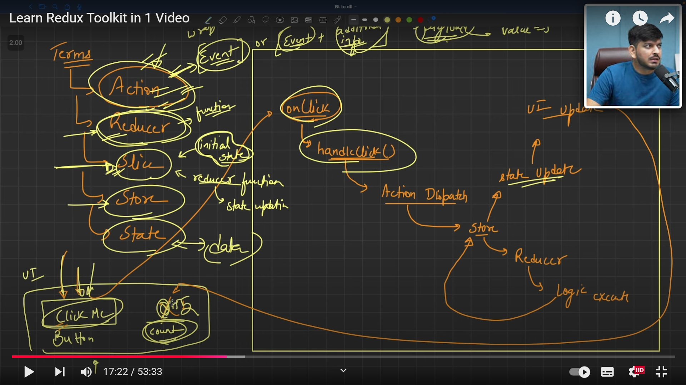
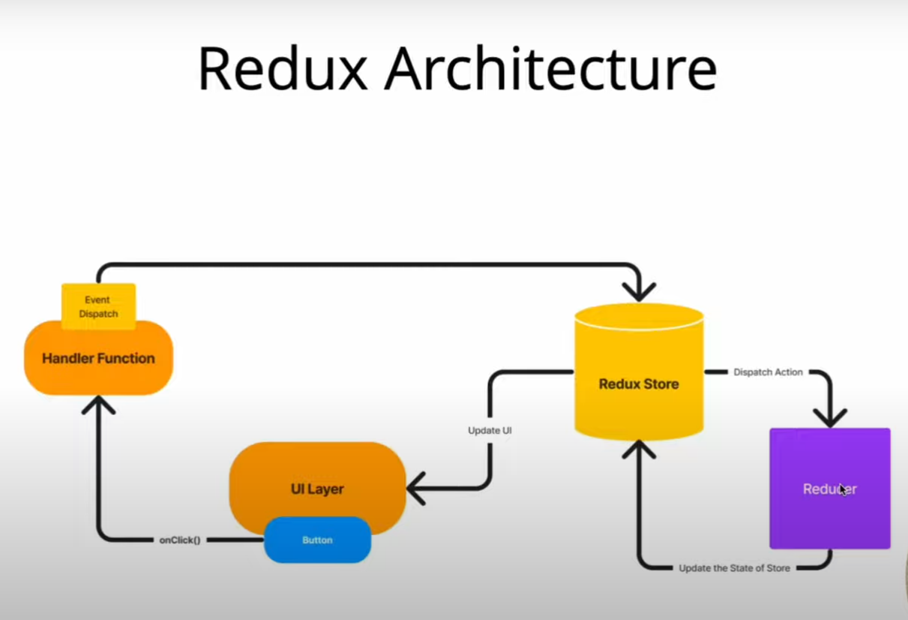

# Docs
### Redux-Toolkit : [Link](https://redux-toolkit.js.org/tutorials/quick-start)

## Flow of Redux Toolkit
### Slice Creation: Contains the initialState, reducers, and actions.
### Store Configuration: Combines all slices and initializes the store.
### Provider: Connects the store to the React app.
### State Access: useSelector fetches data from the store.
### Dispatch Actions: useDispatch triggers state updates.

